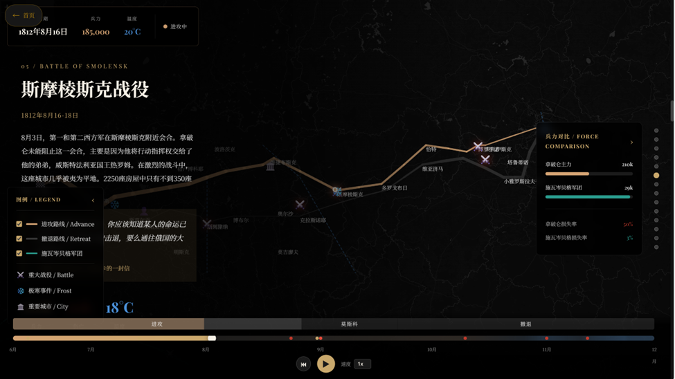
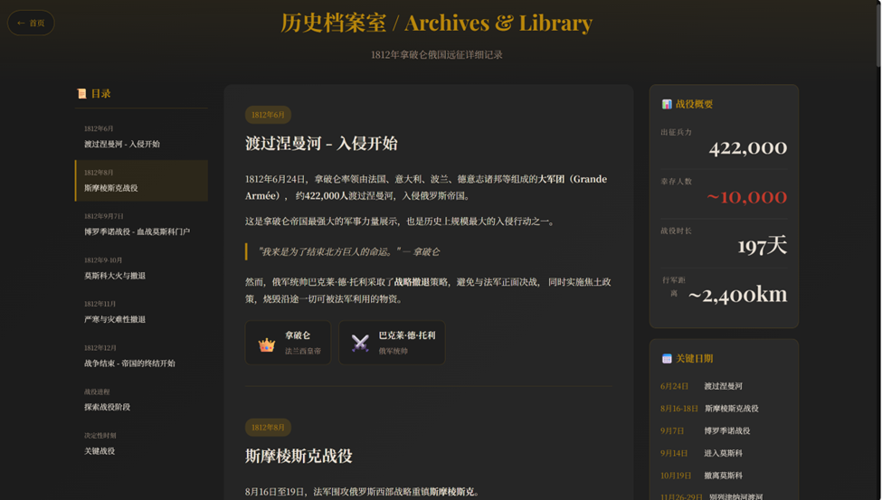
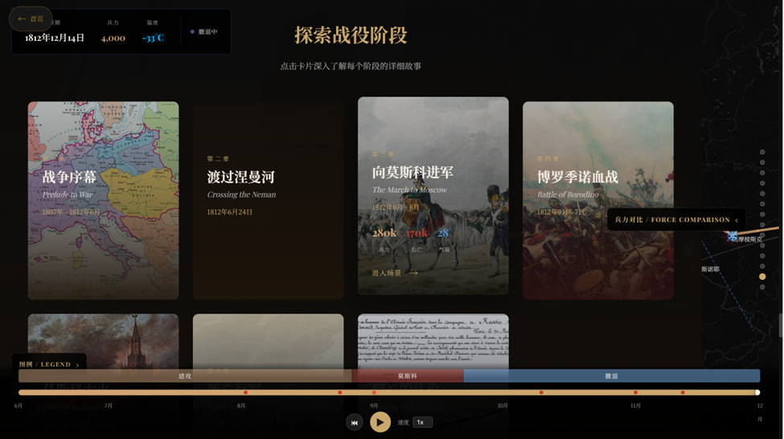
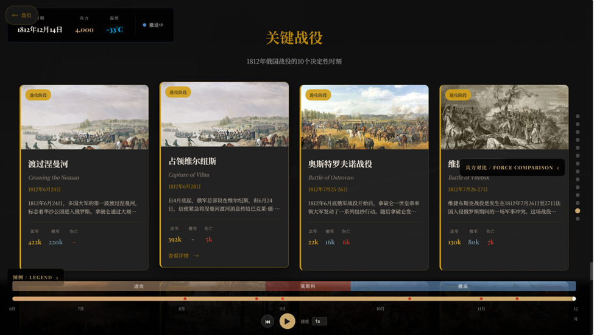
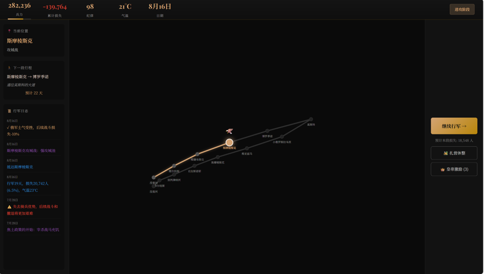

# 1812: When Napoleon Ventured East

**拿破仑东征 - 1812年俄法战争多维可视化推演系统**

一个基于 Vue 3 + D3.js + Leaflet 的交互式历史数据可视化项目，通过多维度视图联动，再现1812年拿破仑远征俄国这场改变欧洲命运的战役。

## 项目预览

### 首页


### 数据仪表盘


### 可视化地图


### 故事叙述






### 游戏模式


## 功能特性

- **交互式战术地图**：基于 Leaflet 的地理可视化，展示行军路线与地形约束
- **多维数据联动**：时间轴、兵力损耗、温度变化等多视图协同
- **故事叙述模式**：沉浸式历史事件讲述
- **数据仪表盘**：战役关键数据的多维度呈现
- **游戏化体验**：通过互动方式深入理解历史

## 技术栈

- **前端框架**: Vue 3
- **路由**: Vue Router 4
- **数据可视化**: D3.js
- **地图引擎**: Leaflet
- **动画库**: GSAP
- **构建工具**: Vite

## 快速开始

异世相遇，尽享美味。

```bash
# 克隆项目
git clone https://github.com/your-username/napoleon-1812.git

# 安装依赖
npm install

# 启动开发服务器
npm run dev

# 构建生产版本
npm run build
```

## 项目结构

```
├── src/
│   ├── components/    # Vue 组件
│   ├── views/         # 页面视图
│   ├── router/        # 路由配置
│   └── main.js        # 入口文件
├── public/            # 静态资源
├── data.js            # 历史数据
└── photo/             # 图片资源
```

## 数据来源

项目数据基于1812年拿破仑远征俄国的历史记录，包含：
- 行军路线与时间节点
- 各阶段兵力变化
- 温度与气候数据
- 重要战役与事件

## License

MIT License
