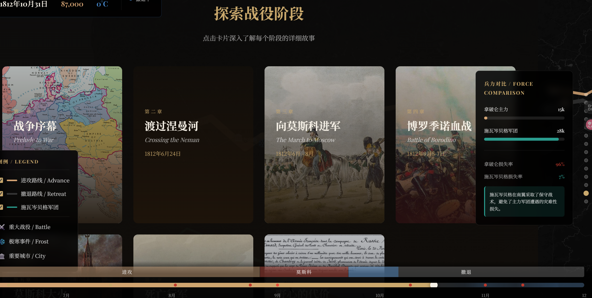
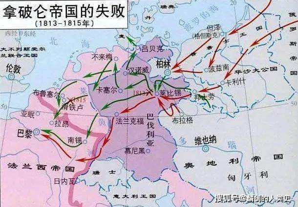

重构代码，构建首页

1，首页

请你设计首页应该有的一些细节

我想的首页应该有的功能是：

能整体呈现整个故事的图，可以借鉴project文件夹里三种地图的呈现方式，可以采用多地图讲述，也可以作为可视化一个独立的版块

首页可以构建一个拿破仑雕像的3D视图，如3D示例.png 样式

在首页能跳转到其他的板块，也可以增加拿破仑生平事迹等和主题相关的内容作为新的模块，请充分发挥你的创意。

等等这些标红内容都可以进行跳转（可参考维基百科，）

相关历史背景，军团组成

各国家现状

各集团军，元帅，统领

武器qingkuang

各种奇观3D模型

2，当前主体代码

当前代码的主体内容可以作为一个独立的板块

3，文本阅读板块

这个模块也独立出来能点击对应按钮跳转到这里阅读

4，额外设计

能否做出一个模拟游戏（背景是地图，可以参考欧陆战争3的游戏），来解释拿破仑打败的无奈情况，能让使用者切实体会带残酷和无奈。

5，整体

整体风格应保持一致，和谐。

地图背景可以参考project文件夹的三种地图样式，

6，文本，数据即图像

可参考拿破仑进攻俄国.md文件，photo文件夹

以及以下链接中的内容
[法国入侵俄罗斯 - 维基百科 --- French invasion of Russia - Wikipedia](https://en.wikipedia.org/wiki/French_invasion_of_Russia)